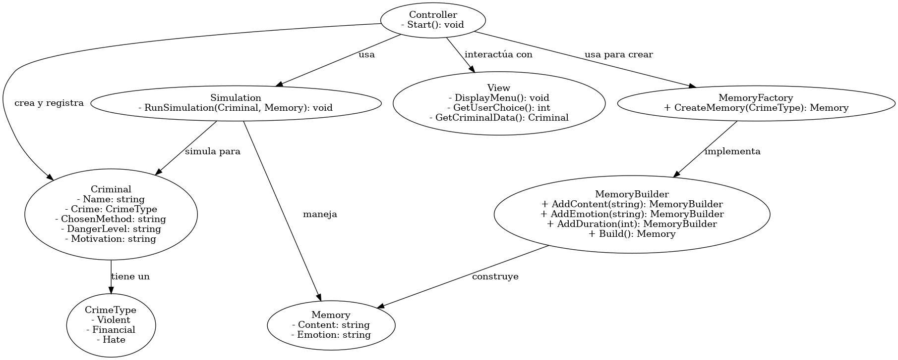
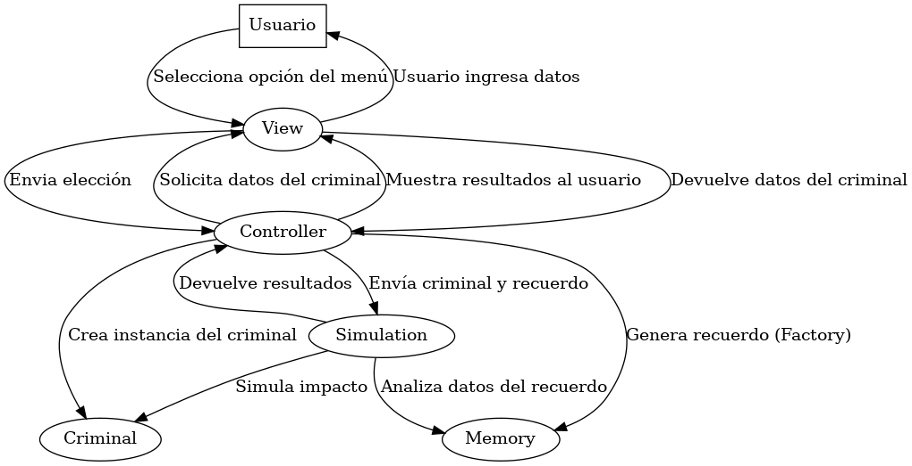
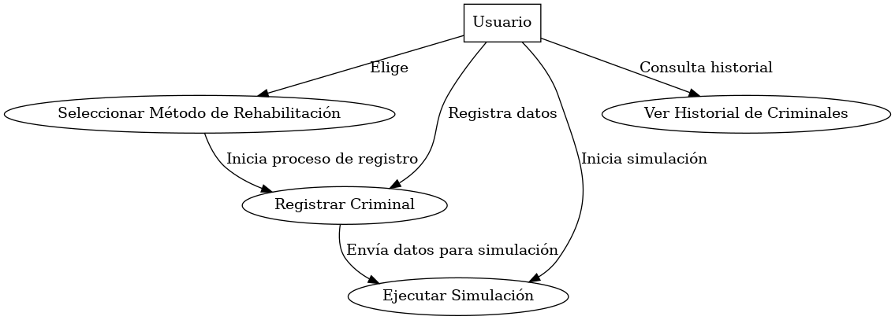

## Cognify: Transformación de la Rehabilitación Criminal
Cognify es un sistema de rehabilitación acelerada basado en recuerdos artificiales, implementado en C# usando una interfaz de consola.

### Cómo ejecutar el proyecto
1. Clona el repositorio:
   ```bash
   git clone https://github.com/IsaacDeHaro/CognifyProject
   cd CognifyProject
   ```
2. Compila y ejecuta:
   ```bash
   dotnet build
   dotnet run
   ```

### Estructura del Código
- `Models/`: Contiene las clases principales como `Criminal`, `Memory`, y `Simulation`.
- `Views/`: Maneja la interacción con el usuario.
- `Controllers/`: Coordina las operaciones entre el modelo y la vista.

## Documentación Técnica

Los siguientes diagramas UML describen la arquitectura y el flujo del sistema Cognify:

### 1. Diagrama de Clases


### 2. Diagrama de Secuencia


### 3. Diagrama de Casos de Uso

